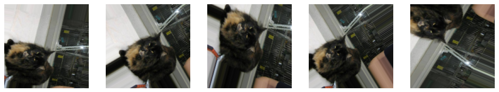

Image Classifier using TensorFlow
=================================

*   [Code](Dogs_and_Cats.ipynb)
*   [Project Description](#project-description)
*   [What I Learned](#what-i-learned)
*   [Project Highlights](#project-highlights)
*   [Things to Improve](#things-to-improve)

Project Description
-------------------

This project focuses on developing an Image Classifier using `TensorFlow`, designed to accurately classify images as either 'cat' or 'dog'. The primary goal of this project was to delve into the realm of Computer Vision and gain practical experience in training machine learning models to recognize and differentiate between images of cats and dogs. This was my first experience with vision models, and while still a relatively simple project, I substantially learned from it. 

### What I Learned

*   **TensorFlow and Convolutional Neural Networks (CNNs)**: Acquired hands-on experience with TensorFlow and the use of Convolutional Neural Networks (CNNs) for image classification tasks. Learned about the significance of convolutional layers, pooling layers, and fully connected layers in processing and learning from image data.

*   **Image Data Preprocessing**: Gained insights into the crucial steps of preprocessing image data, such as resizing, normalization, and augmentation, to prepare it for efficient learning by a neural network. I had to apply a set random changes to each images to significantly increase the testing data.

<div align="center">
  
</div>


*   **Model Evaluation and Fine-tuning**: Mastered the techniques for evaluating the performance of an image classification model using metrics like accuracy and loss. Explored various strategies for model optimization, including fine-tuning hyperparameters and employing transfer learning. I trained more than 50 epochs, for each parameter change, and selected the model that performed best on real-world data avoiding overfitting. 

*   **Handling Overfitting**: Faced and addressed the challenge of overfitting, implementing strategies such as data augmentation and dropout to improve the model's generalization to new, unseen images.


```
15/15 [==============================] - 115s 7s/step - loss: 2.8698 - accuracy: 0.5411 - val_loss: 4.0334 - val_accuracy: 0.5234
15/15 [==============================] - 118s 8s/step - loss: 2.5178 - accuracy: 0.5561 - val_loss: 3.4502 - val_accuracy: 0.4967
15/15 [==============================] - 113s 8s/step - loss: 2.0056 - accuracy: 0.5203 - val_loss: 1.5104 - val_accuracy: 0.5067
15/15 [==============================] - 127s 8s/step - loss: 2.0310 - accuracy: 0.5134 - val_loss: 0.6931 - val_accuracy: 0.5045
15/15 [==============================] - 117s 8s/step - loss: 1.8025 - accuracy: 0.5198 - val_loss: 0.6931 - val_accuracy: 0.4888
15/15 [==============================] - 110s 7s/step - loss: 1.6834 - accuracy: 0.5406 - val_loss: 0.6931 - val_accuracy: 0.4978
15/15 [==============================] - 109s 7s/step - loss: 1.4822 - accuracy: 0.5235 - val_loss: 0.6931 - val_accuracy: 0.4978
15/15 [==============================] - 109s 7s/step - loss: 1.7163 - accuracy: 0.5064 - val_loss: 0.6931 - val_accuracy: 0.5000
15/15 [==============================] - 129s 9s/step - loss: 1.8952 - accuracy: 0.4899 - val_loss: 0.8129 - val_accuracy: 0.4877
15/15 [==============================] - 118s 8s/step - loss: 1.6270 - accuracy: 0.4952 - val_loss: 0.6931 - val_accuracy: 0.4967
15/15 [==============================] - 117s 8s/step - loss: 1.7384 - accuracy: 0.4722 - val_loss: 0.7440 - val_accuracy: 0.5089
15/15 [==============================] - 118s 8s/step - loss: 1.5905 - accuracy: 0.4856 - val_loss: 0.7432 - val_accuracy: 0.5067
15/15 [==============================] - 139s 9s/step - loss: 1.4589 - accuracy: 0.4786 - val_loss: 0.7732 - val_accuracy: 0.5011
15/15 [==============================] - 111s 7s/step - loss: 1.5294 - accuracy: 0.4866 - val_loss: 0.7913 - val_accuracy: 0.4911
15/15 [==============================] - 113s 7s/step - loss: 1.5190 - accuracy: 0.4909 - val_loss: 0.7592 - val_accuracy: 0.4922
15/15 [==============================] - 118s 8s/step - loss: 1.3890 - accuracy: 0.4995 - val_loss: 0.8579 - val_accuracy: 0.4978
15/15 [==============================] - 109s 7s/step - loss: 1.3727 - accuracy: 0.5027 - val_loss: 1.7727 - val_accuracy: 0.5011
15/15 [==============================] - 127s 8s/step - loss: 1.3053 - accuracy: 0.5096 - val_loss: 1.0550 - val_accuracy: 0.5301
15/15 [==============================] - 119s 8s/step - loss: 1.3570 - accuracy: 0.5128 - val_loss: 1.1476 - val_accuracy: 0.5580
15/15 [==============================] - 119s 8s/step - loss: 1.5965 - accuracy: 0.4984 - val_loss: 1.2491 - val_accuracy: 0.5067
15/15 [==============================] - 109s 7s/step - loss: 1.4153 - accuracy: 0.5112 - val_loss: 1.3662 - val_accuracy: 0.5045
15/15 [==============================] - 118s 8s/step - loss: 1.4387 - accuracy: 0.5085 - val_loss: 1.3916 - val_accuracy: 0.5022
15/15 [==============================] - 128s 9s/step - loss: 1.5061 - accuracy: 0.5198 - val_loss: 2.2269 - val_accuracy: 0.5056
15/15 [==============================] - 121s 8s/step - loss: 1.5617 - accuracy: 0.5272 - val_loss: 2.5830 - val_accuracy: 0.5056
15/15 [==============================] - 117s 8s/step - loss: 1.8545 - accuracy: 0.5267 - val_loss: 2.3506 - val_accuracy: 0.5156
15/15 [==============================] - 118s 8s/step - loss: 1.9893 - accuracy: 0.5315 - val_loss: 2.0265 - val_accuracy: 0.5190
15/15 [==============================] - 118s 8s/step - loss: 1.9120 - accuracy: 0.5304 - val_loss: 2.1472 - val_accuracy: 0.5212
15/15 [==============================] - 110s 7s/step - loss: 1.8331 - accuracy: 0.5219 - val_loss: 2.2855 - val_accuracy: 0.5234
15/15 [==============================] - 110s 7s/step - loss: 1.9035 - accuracy: 0.5267 - val_loss: 2.1512 - val_accuracy: 0.5301
15/15 [==============================] - 118s 8s/step - loss: 1.6570 - accuracy: 0.5182 - val_loss: 1.4792 - val_accuracy: 0.5312
15/15 [==============================] - 117s 8s/step - loss: 1.4035 - accuracy: 0.5118 - val_loss: 1.1137 - val_accuracy: 0.5167
15/15 [==============================] - 127s 8s/step - loss: 1.4652 - accuracy: 0.5112 - val_loss: 1.0954 - val_accuracy: 0.5156
15/15 [==============================] - 119s 8s/step - loss: 1.5317 - accuracy: 0.5128 - val_loss: 1.0143 - val_accuracy: 0.5078
```

### Project Highlights

*   **Model Architecture**: The model employs a CNN architecture, starting with convolutional layers for feature extraction followed by pooling layers to reduce dimensionality. The network concludes with fully connected layers, culminating in a binary output indicating the likelihood of an image being a cat or a dog.
*   **Dataset**: Utilized a comprehensive dataset of cat and dog images, which was instrumental in training the model to accurately classify the images. The dataset's diversity and size were key factors in the model's learning and performance.
*   **Results**: The classifier demonstrated an accuracy of ``66%``, clearly above random capabilities to recognize the images. Given the small dataset, this is a relatively good performance, that could be improved with more training.

### Things to Improve

This project was an invaluable learning opportunity, shedding light on the intricacies of working with image data and the effectiveness of TensorFlow and CNNs in building powerful image classification models. It underscored the importance of meticulous preprocessing and the impact of model architecture on classification accuracy.

However, there are several areas for improvement in future projects:

*   **Expand the Dataset**: To further enhance the model's accuracy and generalization, I plan to train it on a larger and more varied dataset of images.

*   **Experiment with Advanced Models**: Investigate the use of more sophisticated model architectures, such as deeper CNNs or models pre-trained on large datasets (transfer learning), to improve classification performance.
*   **Deploy the Model**: Develop a web or mobile application that leverages the trained model for real-time image classification, allowing users to upload images and receive immediate classification results.

